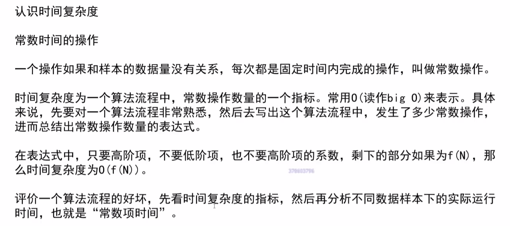

# Algorithm Learn

- 对数器
- 比较器
- 树形DP: 可以通过向左树和右树要信息解决的问题。

---

### 1. 求中点

常规: (L+R)/2 ---->当L+R的值超过最大值时会不对，可以改为L+(L-R)/2,用位运算可进一步简化为L+((L-R)>>1)

### 3. 排序

排序回顾(P5 4.第四章 链表开头)

### 4. 哈希

**HashMap(O(N)):**

**TreeMap(O(log(N))):**

**A. 判断单链表是否有环并返回成环的第一个节点(快慢指针)**: 

1. 快指针一次走两步，慢指针一次走一步，如果两个指针有相遇则证明有环；
2. 之后慢指针指回链表头部，快指针留在相交位置。快慢指针同时向前一次走一步，再一次相遇的位置就是第一个成环的节点。

**B. 判断两个无环单链表是否相交以及第一个相交节点:**

1. 分别遍历两个链表，计算链表长度记为len1，len2，比较两个链表的位节点是否相同，如果相同则两链表相交，否则不相交;
2. 起始位置，指针1指向短链表(假设为len1)，指针2指向len2链表的(len2-len1)位置处;
3. 两个指针同时向前一次移动一步，第一次相遇的节点即为相交节点；

**C. 判断两个有环单链表是否相交以及第一个相交节点:**

1. 两个单链表分别都走到各自第一个成环的节点处。如果两个节点相同，则相交(case2).再用B办法求出第一个相交节点；如果两个节点不同，继续步骤2；

2. 其中一个单链表停留在其第一个成环节点处，另一个单链表从第一个成环节点继续往前走，在再次回到成环节点处过程中。如果遇到了另一个链表的成环节点，则表示两个链表相交，且相交节点有两个，分别为两个链表的第一个成环节点；如果没遇到，说明两个链表不相交。

   

   

### 5. 二叉树

#### A. 递归序(每一个节点都可以到达三次)

**前序(根左右):** 仅在1位置做动作(打印)

**中序(左根右):**仅在2位置做动作

**后序(左右根):**仅在3位置做动作

#### B. 非递归序

**前序(根左右),深度优先遍历:**栈实现

**后序(左右根):** 栈+收集栈实现

**中序(左根右):**栈实现

**宽度优先遍历:** 队列

#### C.训练

- **如何判断一棵树为搜索二叉树？**(搜索二叉树: 节点值不重复，对于任何一个根节点总是大于左节点，小于右节点)

  用**中序**遍历，如果结果呈递增序列，则为搜索二叉树。

  

  

- **如何判断一棵二叉树为完全二叉树？**

  用**宽度遍历**

  

  

  

- **如何判断一棵树为满二叉树?**

  先计算最大深度h，再计算全部节点数m。如果m=2eh-1,则为满二叉树
  
  

- **如何判断一棵二叉树是否是平衡二叉树?**

  

  

### 6. 图

> 图是有可能成环的，要有机制防止它陷入循环，比如用Set记录下走过的Node，之后做检查

##### A. 图的存储方式

- 邻接表
- 邻接矩阵

**图模板:**

### 7. 前缀树

**何为前缀树?如何生成前缀树？**

### 8. 贪心算法

安排最多场会议，先以最早结束时间进行排序，给定一个起始时间start，遍历排序后的全部会议，如果会议开始时间晚于start，则安排，然后将该会议的end时间赋值给start。

**哈夫曼编码问题**： 小根堆结合

