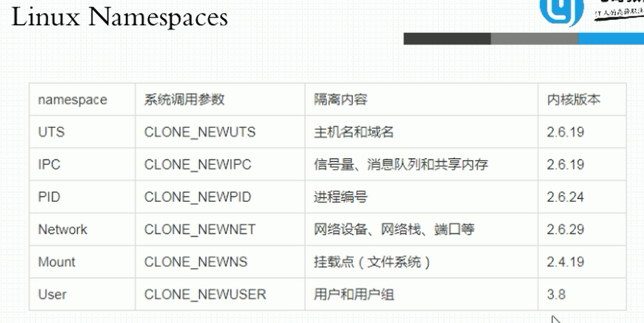
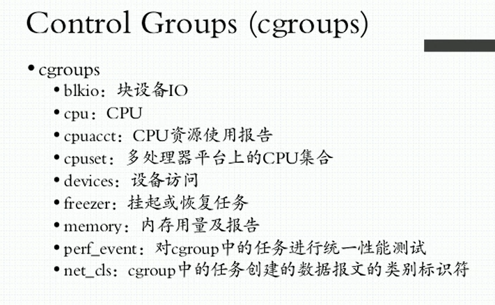

# Introduction of Docker

### Ⅰ. 虚拟化技术

#### A. 主机级虚拟化

##### - Type1: 硬件虚拟化

> 直接在硬件平台上安装一个`VMM`( Virtual Machine Monitor，[虚拟机监控器][https://baike.baidu.com/item/%E8%99%9A%E6%8B%9F%E6%9C%BA%E7%9B%91%E8%A7%86%E7%A8%8B%E5%BA%8F/20839241?fr=aladdin&fromtitle=VMM&fromid=7047240] )，一般叫 *Hypervisor* ，再在其上创建虚拟机

##### - Type2: 宿主机虚拟化

> 在宿主机系统上，通过安装`VMM`来创建虚拟机。例如：VMware

#### B. 容器虚拟化技术的不同实现方式

> 其兴起主要是通过隔离不同的用户空间，保证各个进程运行在单个用户空间，之间能够相互不干扰，同时又能共用一个宿主机内核，节省系统开销。

> - ***内存是不可压缩性资源（分配出去后没办法立刻回收），必须严格准守分配规则；CPU是可压缩性资源，可以弹性分配（按比例分配）***

**`Nampspaces`** --- **实现虚拟化内核级别需要涉及到隔离的部分：**

- UTS: 主机名/域名
- Mount: 文件系统
- IPC:  进程间通信 
- PID: 进程树，在一个进程树中，PID为1的只能有一个，即主进程
- User: 用户组
- Network: 网络

- 利用`cgroups`来进行用户空间的资源分类（cgroups内部还可以再进行细分）

#### C. 容器虚拟化技术的不同实现

##### 1. LXC(LinuX Container)

##### 2. Docker

> 初期利用LXC作为容器管理引擎，进行二次封装。在一个容器中只运行一个进程，使得彼此之间不可见。但也产生了以下问题：
>
> 1. 使得进程无法集中管理，需要分散在各个容器中
> 2. 部分共享文件需要存在多份