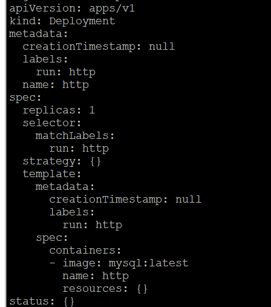

# K3S & K8S

#### 1. Generate K8S yml file

- [如何快速创建k8syaml文件模板][https://blog.csdn.net/scylhy/article/details/85159393]

```linux
sudo kubectl run http --image=mysql:latest --replicas=1 --dry-run -ncka -o yaml
```



