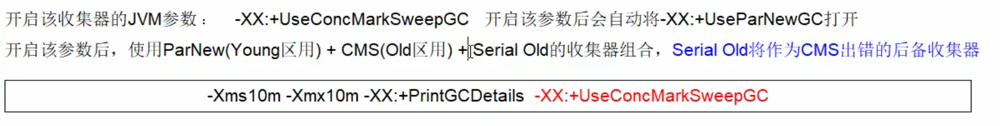
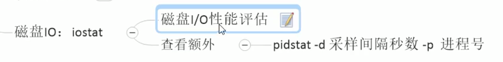
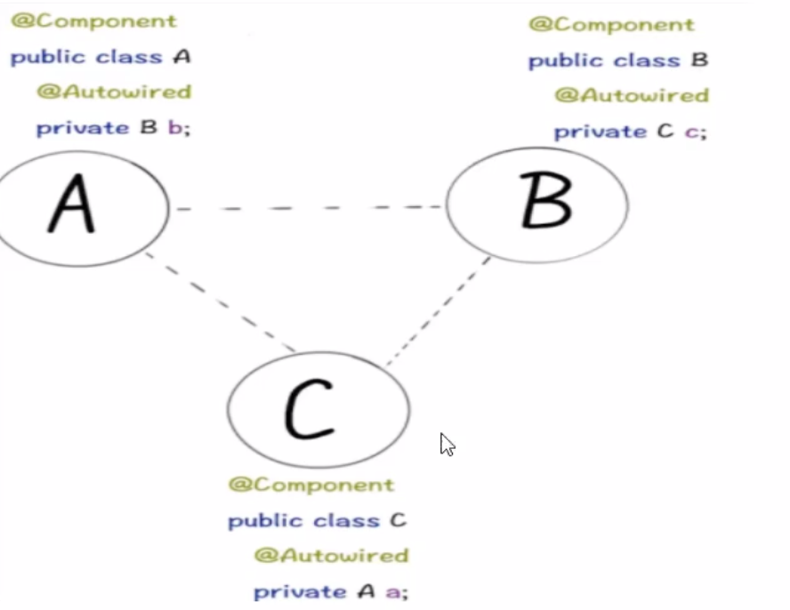
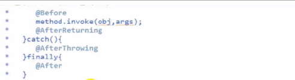

# Java Question

#### 1. synchronized 和 Lock有什么区别？用Lock有什么好处？


- **A:原始构成**

> Synchronized 是JVM底层实现(用monitor实现),是java保留关键字。不存在死锁情况，正常和异常都有monitorexit;
>
> Lock是具体类，是API层面的锁

- **B:使用方法**

>Synchronized 不需要用户手动释放；Lock相反，需要配合try{}finally{}.

- **C:等待是否可中断**

> Synchronized 不可中断，除非抛出异常或者程序执行完成。
>
> Lock 可中断，
>
> 	1. 设置超时方法 trylock(Long timeout, TimeUnit unit)
>
>  	2. lockinterruptibly()放入代码块中，调用interrupt()可中断

- **D:加锁是否公平**

> Synchronized  是非公平锁
>
> Lock 两者都可以，默认为非公平

- **E:绑定多个条件**

> Synchronized  没有实现，要么随机唤醒一个线程，要么唤醒全部。
>
> Lock用来实现分组唤醒需要唤醒的线程们，可以根据condition精确唤醒。

#### 2. 为什么要使用池（线程池，连接池类技术）


#### 3. 线程池是3个常用方法

> 线程池的几个重要参数(7大参数):
>
> 
>
> 
>
> 1. **corePoolSize:** 线程池中常驻核心线程数。当线程池中的线程数目达到corePoolSize后，就会把到达的任务放到缓存队列中。
> 2. **maximumPoolSize:** 线程池能够有容纳同时执行的最大线程数，必须 >=1
> 3. **keepAliveTime:** 多余的空闲线程存活时间。当前线程池数量超过**corePoolSize** 时，当空闲时间也达到keepAliveTime时，多余线程就会被销毁直到只剩下**corePoolSize** 个线程为止。
> 4. **TimeUnit:** keepAliveTime的时间单位
> 5. **BlockingQueue:** 任务队列，被提交但尚未执行的任务
> 6. **ThreadFactory:** 表示生成线程池中工作线程的线程工厂，用于创建线程，一般用默认的即可。
> 7. **RejectedExecutionHandler:** 拒绝策略，表示当队列满了且工作线程也达到了**maximumPoolSize** 时如何来拒绝请求执行的策略。

>  内部全都由ThreadPoolExecutor实现
>
> executor()方法无参数返回
>
> submit()方法有返回值，可以接受Callerable 接口的实现类，返回值为Future<?>

- **Executors.newSingleThreadExecutor()** --- 一个任务一个任务执行的场景

  > 内部任务存储在LinkedBlockingQueue<Runnable>()


- **Executors.newFixedThreadPool()** --- 执行长期任务，性能好很多，线程可以轮替复用


- **Executors.newFixedThreadPool()**  --- 执行很多短期异步的小程序或者负载较轻的服务器

  > 内部任务存储在SynchronousQueue<Runnable>()
  >
  > SynchronousQueue: 不存储元素的阻塞队列，即单个元素的队列。产生一个，消费一个，超过一个就阻塞。


#### 4. 线程池底层工作原理


#### 5.死锁编码及定位分析

```java
class DeadTest {

    static void main(String[] args) {
        String resource1 = new String("a")
        String resource2 = new String("b")

        new Thread({
            synchronized (resource1){
                println("${Thread.currentThread().name} have resource: ${resource1}")
                TimeUnit.SECONDS.sleep(3)
                synchronized (resource2){
                    println("${Thread.currentThread().name} have resource: ${resource2}")
                }
            }
        },"Thread-A").start()

        new Thread({
            synchronized (resource2){
                println("${Thread.currentThread().name} have resource: ${resource2}")
                TimeUnit.SECONDS.sleep(3)
                synchronized (resource1){
                    println("${Thread.currentThread().name} have resource: ${resource1}")
                }
            }
        },"Thread-B").start()

    }

}
```


**jps -l**命令定查看java的后台进程

**jinfo -flag <args>**  <pid>查看正在运行中的java指定信息

**jinfo -flags <pid>** 查看正在运行中的java全部信息


jstack找到死锁查看


#### 6. 哪些对象可以作为GC Root对象？

1. 虚拟机栈中(局部变量表)引用的对象
2. 方法区中的类静态属性引用的对象
3. 方法区中常量引用的对象
4. 本地方法栈中引用的对象

#### 7. 如何查看JVM系统默认值

- JVM的参数类型

  - 标配参数(3)

    > 从JDK1.0开始就一直存在,很少有大的变化，了解即可

    -version

    -help

    java -showversion

  - X参数(6)

    > 了解即可

    

    

  - **XX参数(30)**

    

    

    

    

- 查看JVM默认值

  **jps -l**命令定查看java的后台进程

  **jinfo -flag <args>**  <pid>查看正在运行中的java指定信息

  **jinfo -flags <pid>** 查看正在运行中的java全部信息

  **java -XX:+PrintFlagsInitial** 查看JVM初始化参数(程序未启动时参数，出厂参数)

  

  

  **java -XX:+PrintFlagsFinal** 被修改以后最终的JVM参数

  **java -XX:+PrintFlagsFinal -<arg>** 被修改以后最终的某个JVM参数

  **java -XX:+PrintCommandLineFlags -version** 查看当前JVM所使用的的是何种垃圾回收器

  

#### 8. GC

查看默认的垃圾收集器,在程序运行时执行以下命令:

```java
java -XX:+PrintCommandLineFlags -version
```


- **4种GC算法思想**

  - 引用计数
  - 复制拷贝
  - 标记清理
  - 标记压缩

- **具体实现**

  - **Serial**: 串行回收
  - **Parallel**: 并行回收
  - **CMS**(ConcMarkSweep): 并发回收，标记清除，会有内存碎片
  - **G1**

- **7种垃圾回收**(UseSerialOldGC 已经被Java8废弃了)

  - **UseSerialGC**
  - **UseParallelGC**
  - **UseConcMarkSweepGC**
  - **UseParNewGC**
  - **UseParallelOldGC**
  - **UseG1GC**

  

  

  





#### 9. 生产环境服务器变慢，诊断思路和性能评估(linux)？


```linux
top
```


```linux
vmstat -n 2 3
```


```linux
ps -ef|grep java //全格式显示所有进程中包含java的进程
pidstat -u 1 -p 5101 //查看5101进程的CPU用量
```





#### 10. Github 搜索


- 搜索框

  - springboot in:name,description,redme

    > 搜索在name,description,redme中出现过springboot关键字的项目

  - springboot stars:>=500 fork:>200

    > 搜索stars大于等于500且fork大于200的springboot关键字项目

  - awesome springboot

    > 搜索springboot相关的教程，一般是用来收集好的学习、工具、书籍类相关的项目

  - location:zhuhai language:java

    > 搜索珠海地区java的用户

- 浏览器

  - #L

    ```http
    https://github.com/sindresorhus/Gifski/blob/main/license   //github 里面的某个代码页面
    ```

    ```http
    https://github.com/sindresorhus/Gifski/blob/main/license#L5  //打开后高亮显示第5行
    ```

    ```http
    https://github.com/sindresorhus/Gifski/blob/main/license#L5-#L9  //打开后高亮显示第5到9行区域
    ```

  - t    项目内搜索

    ```http
    https://github.com/sindresorhus/Gifski    //在这个项目页面直接键盘输入t，再输入要查找的内容
    ```

    ```http
    https://docs.github.com/en/github/getting-started-with-github/keyboard-shortcuts  //github 快捷键及其说明文档
    ```

    

#### 11. LockSupport

> 线程等待、唤醒机制的改进加强版

- park(): 阻塞线程
- uppark(): 解除阻塞线程


- 传统的wait和notify(synchronize)实现线程等待和唤醒的特点:

  1. wait 和notify方法必须要在synchronize同步代码块或者方法里面，并且成对出现使用
  2. 必须先wait，后notify

- await和signal(Condition, Lock)实现线程等待和唤醒的特点:

  同上

- **LockSupport**实现线程等待和唤醒的特点:

  1. 正常+无锁块要求
  2. 可以支持先唤醒，后等待(这种情况下的等待形同虚设)

> 传统的synchronize和Lock实现等待唤醒通知的约束:
>
> 1. 线程先要获得并持有锁，必须在锁块(synchronize和Lock)中
> 2. 必须要先等待，后唤醒，线程才能被唤醒


#### 12. AbstractQueuedSynchrinizer (AQS)

>


#### 13. Spring IOC

##### A. Spring循环依赖

> 多个bean之间相互依赖，形成了一个闭环。
>
> 如：A依赖B，B依赖C，C依赖A




**两种注入方式对循环依赖的影响**: 构造方法注入对循环依赖问题不友好，而Setter方法注入更被spring官方所推荐(setter 会先用默认构造方法创建对象，再进行设值)。


**Spring 内部是通过三级缓存来解决循环依赖的问题**

##### B. Spring三级缓存


##### C. Spring容器


#### 14. Spring AOP

- **AOP 常用注解**:

  @Before: 前置通知

  @After: 后置通知

  @AfterReturning: 返回后通知

  @AfterThrowing: 异常通知

  @Around: 环绕通知

- **AOP的全部执行顺序**:


| Case      | Springboot1(Spring4)                         | Springboot2(Spring5)                         |
| --------- | -------------------------------------------- | -------------------------------------------- |
| Normal    |  |  |
| Exception |  |  |




#### 15. Spring TX

