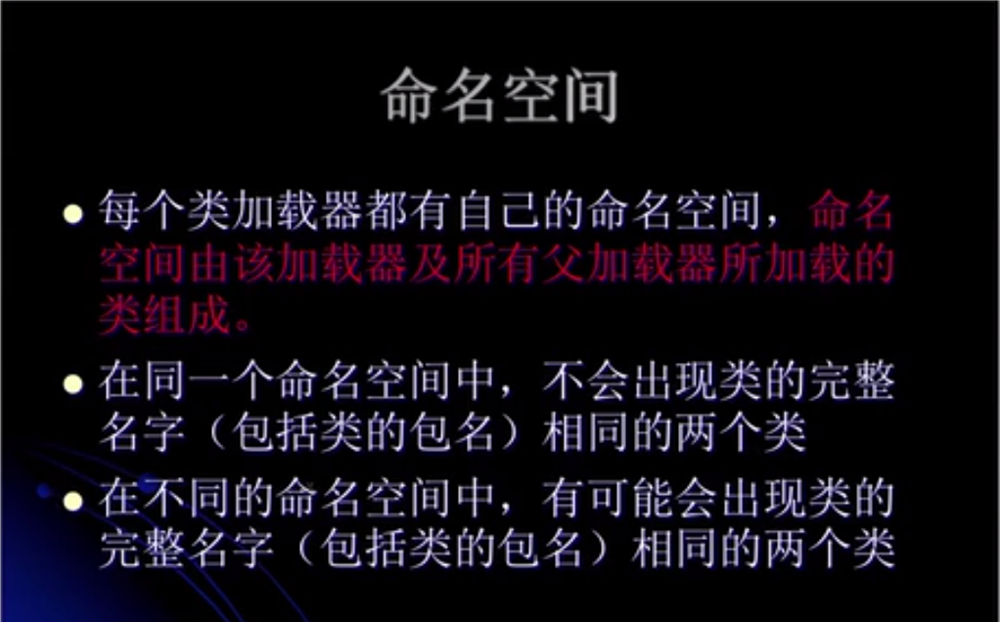
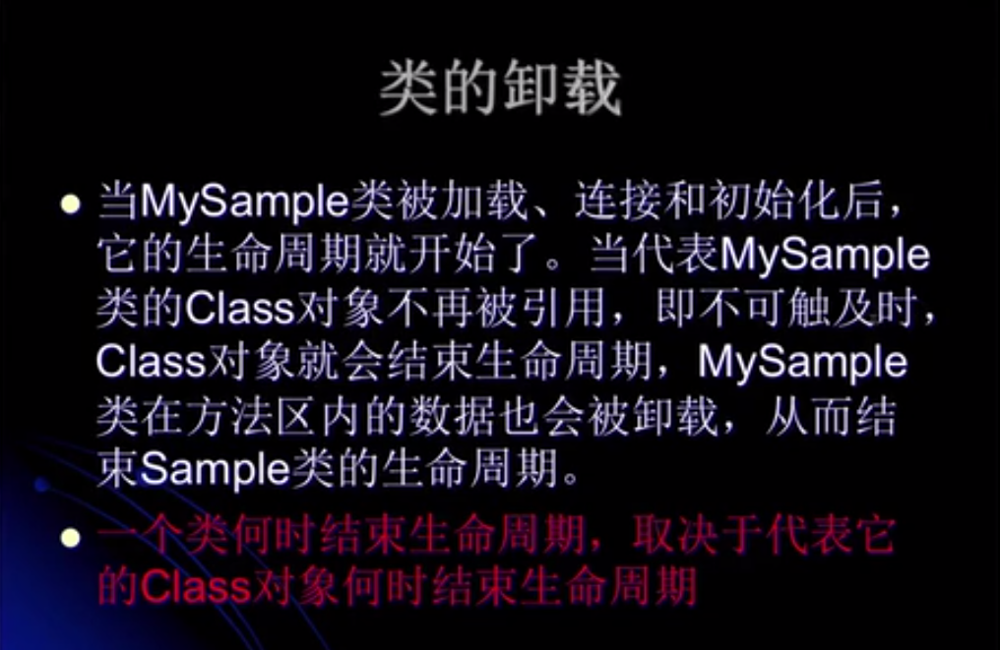
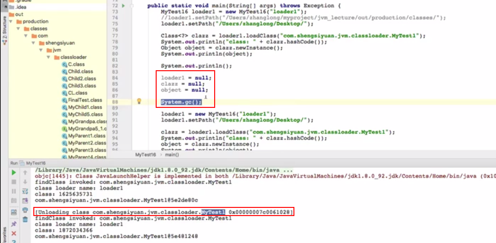
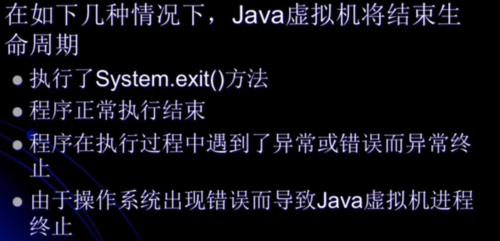

# 1：Basic Knowledge of Class Loading - Ⅰ

> **在Java代码中，类的加载、连接与初始化过程都是在程序运行期间完成的。提供了更大的灵活性，增加了更多的可能性。**（C或C++是在编译期确定的）

## Ⅰ. 类加载步骤

### 1. 加载

> 查找并加载类的二进制数据
>
> 类加载器并不需要等到某个类被`首次主动使用`（跟初始化相区别）时再加载它


- 获取启动类加载器，扩展类加载器，应用类加载器加载类的路径

```java
    public static void main(String[] args) throws Exception {
        System.out.println(System.getProperty("sun.boot.class.path")); //启动类加载器
        System.out.println(System.getProperty("java.ext.dirs")); //扩展类加载器
        System.out.println(System.getProperty("java.class.path")); //应用类加载器

    }

//扩展类加载器和应用类加载器都位于Launcher.class中，可以从该类中找到上面的加载路径
```


- 扩展类加载器只会加载以.jar结尾的类，而不会加载以.class结尾的类。即修改扩展类加载器加载类的位置，也不一定会加载对应位置下的.class文件


### 2. 连接

#### - 验证

> *确保加载类的正确性与合法性*
>
> 	- 类文件的结构检查
> 	- 语义检查
> 	- 字节码检查
> 	- 二进制兼容性检查

 

#### - 准备

> 为类的***静态变量***分配内存，并将其初始化为***默认值***

#### - 解析

> 把类中的符号引用转换为直接引用（指针）

### 3. 初始化

> 为类的静态变量赋予真正的初始值(只有`首次主动`使用才会初始化)
>
> 静态变量的声明语句，以及静态代码块都被看做类的初始化语句，Java虚拟机会按照初始化语句在类文件中的先后顺序来依次执行它们。


- 访问某个类或者接口的静态变量，或者对该静态变量的赋值，或者对该静态方法的使用（**这个静态变量/方法定义在哪，就表示对哪个类对的主动使用**）

 ```java
public class test {
    public static void main(String[] args) {
        System.out.println(Child.a);
    }
}


class Parent{
   public static int a = 10;
   static {
       System.out.println("Parent invoked");
   }
}

class Child extends Parent{
    static {
        System.out.println("Child invoked");
    }
}
 ```

> 没有输出"Child invoked"，因为不是对Child的主动使用


- 反射是对类的主动使用，会导致类的初始化。相反，调用ClassLoader类的loadClass方法加载一个类，并不是对类的主动使用，不会导致类的初始化。

```java
public class test {
    public static void main(String[] args) throws Exception {
        ClassLoader loader = ClassLoader.getSystemClassLoader();
        Class<?> clazz = loader.loadClass("Parent");
        System.out.println(clazz);
        
        System.out.println("-----------");

        clazz = Class.forName("Parent");
        System.out.println(clazz);
    }
}


class Parent{
   static {
       System.out.println("Parent invoked");
   }
}
```


### 4. 使用

### 5. 卸载


> -XX:+TraceClassLoading， 用于追踪类的加载信息并打印出来
>
> -XX:+TraceClassUnloading， 用于追踪类的卸载信息并打印出来
>
> 
>
> 设置JVM参数的三种方式：
>
> - `-XX:+<option>`表示开启option选项
> - `-XX:-<option>`表示关闭option选项
> - `-XX:<option>=<value>`表示将option选项的值设置为value


## Ⅱ. 常量的本质含义

### 1. 常量在***编译阶段*** 会存入到调用这个常量的方法所在的类的常量池中。本质上，调用类并没有直接引用到定义该常量的类，因此并不会触发定义该常量类的初始化。

> 注意：
>
> ​	这里指的是将常量存放到test的常量池中，之后test与test3就没有任何关系了。甚至，可以将test3编译生成的class文件删除，依然可以取到该常量。


```java
public class test {
    static {
        System.out.println("****** test static block");
    }

    public static void main(String[] args) {
        System.out.println(test3.str);
    }
}

class test3{
    public static String str = "hello world!";
    static {
        System.out.println("------ test3 static block");
    }
}

```


```java
public class test {
    static {
        System.out.println("****** test static block");
    }

    public static void main(String[] args) {
        System.out.println(test3.str);
    }
}

class test3{
    public static final String str = "hello world!";
    static {
        System.out.println("------ test3 static block");
    }
}
```


### 2. 当一个常量的值并非编译期可以确定，那么其值就不会被放到调用类的常量池中。这时在程序运行时，会导致主动使用这个常量所在的类，显然会导致这个类被初始化。

```java
import java.util.UUID;

public class test {
    static {
        System.out.println("****** test static block");
    }

    public static void main(String[] args) {
        System.out.println(test3.str);
    }
}

class test3{
    public static String str = UUID.randomUUID().toString();
    static {
        System.out.println("------ test3 static block");
    }
}

```


### 3. 对于数组实例来说，其类型是由JVM在运行期动态生成的（***仅有数组类对象不是由ClassLoader来创建的，而是由JVM在运行期动态生成的***）。动态生成的类型其父类型就是Object。

> Class objects for array classes are not created by class loaders, but are created automatically as required by the Java runtime. 
>
> The class loader for an array class, as returned by Class.getClassLoader() is the same as the class loader for its element type; if the element type is a primitive type, then the array class has no class loader.

```java
import java.util.UUID;

public class test {
    static {
        System.out.println("****** test static block");
    }

    public static void main(String[] args) {
       test3[] test3 = new test3[1];

        System.out.println("----------------------");
        System.out.println(test3.getClass());
        System.out.println(test3.getClass().getSuperclass());
        System.out.println(test3.getClass().getClassLoader());
    }
}

class test3{
    public static String str = UUID.randomUUID().toString();
    static {
        System.out.println("------ test3 static block");
    }
}
```

> 没有主动使用test3类，所以不会初始化该类


### 4. 当一个接口在初始化时并不要求其父接口都完成初始化（有类加载但是没有初始化）


- Interface extends interface

```java
import java.util.UUID;

public class test {
    public static void main(String[] args) {
        System.out.println(Child.a);
    }
}


interface Parent{
    public static Thread thread = new Thread(){
        {
            System.out.println("Parent invoked");
        }
    };
}

interface Child extends Parent{
    public static String a = UUID.randomUUID().toString();
}
```


- class implement interface

  ```java
  import java.util.UUID;
  
  public class test {
      public static void main(String[] args) {
          System.out.println(Child.a);
      }
  }
  
  
  interface Parent{
      public static Thread thread = new Thread(){
          {
              System.out.println("Parent invoked");
          }
      };
  }
  
  class Child implements Parent{
      public static String a = UUID.randomUUID().toString();
  }
  ```

  

  

- class extends class

```java
import java.util.UUID;

public class test {
    public static void main(String[] args) {
        System.out.println(Child.a);
    }
}


class Parent{
    public static Thread thread = new Thread(){
        {
            System.out.println("Parent invoked");
        }
    };
}

class Child extends Parent{
    public static String a = UUID.randomUUID().toString();
}
```


## Ⅲ. 类加载器准备阶段和初始化阶段的重要意义

```java
public class test {
    public static void main(String[] args) {
        Singleton singleton = Singleton.getInstance();
        System.out.println("a: " + Singleton.a);
        System.out.println("b: " + Singleton.b);
    }
}

class Singleton{
    public static int a;
    public static int b = 0;

    private static Singleton singleton = new Singleton();

    public Singleton() {
        a++;
        b++;

        System.out.println(">>>a: " + a);
        System.out.println(">>>b: " + b);
    }

    public static Singleton getInstance(){
        return singleton;
    }
}

```


---

---


```java
public class test {
    public static void main(String[] args) {
        Singleton singleton = Singleton.getInstance();
        System.out.println("a: " + Singleton.a);
        System.out.println("b: " + Singleton.b);
    }
}

class Singleton{
    public static int a;

    private static Singleton singleton = new Singleton();

    public Singleton() {
        a++;
        b++;

        System.out.println(">>>a: " + a);
        System.out.println(">>>b: " + b);
    }
    public static int b = 0;

    public static Singleton getInstance(){
        return singleton;
    }
}
```

> 因为准备阶段赋初始值0，然后在初始化阶段按顺序执行代码。


```java
public class test {
    public static void main(String[] args) {
        Singleton singleton = Singleton.getInstance();
        System.out.println("a: " + Singleton.a);
        System.out.println("b: " + Singleton.b);
    }
}

class Singleton{
    public static int a;

    private static Singleton singleton = new Singleton();

    public Singleton() {
        a++;
        b++;

        System.out.println(">>>a: " + a);
        System.out.println(">>>b: " + b);
    }
    public static int b;

    public static Singleton getInstance(){
        return singleton;
    }
}
```


## Ⅳ. 类加载器的双亲委托机制

### 1. 获取ClassLoader的途径


- 基本数据类型以及String都是由启动类加载器加载的

> **定义类加载器**：实际加载这个类的类加载器
>
> **初始类加载器**：代码中直接去加载这个类的类加载器


### 2. 命名空间

> ***命名空间由该加载器及所有父加载器所加载的类组成***（JVM视频教程第19,22集，父加载器访问子类加载器中类时报ClassNotFoundException，被命名空间隔离）
>
> ***子加载器所加载的类，可以访问到父加载器所加载的类；***
>
> ***父加载器所加载的类，不可以访问到子加载器所加载的类***



### 3. 双亲委托机制的好处

- 确保Java核心库的类型安全
- 确保Java核心类库提供的类不会被自定义类所替代
- 不同的类加载器可以为相同名称(binary name: `完全限定名`)的类创建额外的命名空间，即相同名称的类可以并存在JVM中。相当于在JVM中创建了多个相互隔离的Java类空间。
- 在运行期，一个Java类是由该类的`完全限定名`(binary name)和用于该类的`定义类加载器`(defining loader)所共同决定的。

### 4. 类加载器自身的类加载器

1. `启动类加载器`：内建于JVM中，由C++编写，是特定于平台的机器指令，它负责开启整个加载过程。
2. `扩展类加载器`：(Java类)由启动类加载器来加载。当JVM启动时，一块特殊的机器码会运行并加载扩展类、启动类加载器，这块特殊的机器码叫做`启动类加载器`。
3. `应用类加载器`：同上

> 通过设置java.system.class.loader可以指定自己定义的类加载器为系统类加载器

### 5.Launcher(25集)


## Ⅴ. 类的卸载



> **由Java虚拟机自带的类加载器所加载的类（`启动类加载器`，`扩展类加载器`，`应用类加载器`），在虚拟机的生命周期中，始终不会被卸载。**Java虚拟机本身会始终引用这些类加载器，而这些类加载器又会始终引用它们所加载的类的Class对象（Class对象也总是会引用它的类加载器，调用getClassLoader方法可以获得其类加载器。因此**类的Class实例与其对应的ClassLoader之间是双向关联的**），因此这些Class对象始终是可触及的。

> **由用户自定义的类加载器所加载的类是可以被卸载的**




## Ⅵ. Java虚拟机结束生命周期



