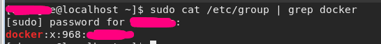

# Centos install Docker

### 1. install JDK8

- [CentOS7安装Java8](https://www.cnblogs.com/zhiyouwu/p/11538148.html)

- [CentOS 设置 yum源](https://www.cnblogs.com/jinxiblog/p/9154608.html)

### 2. Install Docker

##### Step1: 设置yum源为国内镜像（阿里云）

```linux
//backup
mv /etc/yum.repos.d/CentOS-Base.repo /etc/yum.repos.d/CentOS-Base.repo.backup 

//download latest repo
curl -o /etc/yum.repos.d/CentOS-Base.repo http://mirrors.aliyun.com/repo/Centos-8.repo 

//clean old yum cache
yum clean all 

//generate new aliyun cache
yum makecache 
```

##### Step2: 安装依赖

```linux
sudo yum install -y yum-utils device-mapper-persistent-data lvm2
```

##### Step3:  添加 yum 软件源  

```linux
sudo yum-config-manager \
--add-repo \
https://mirrors.ustc.edu.cn/docker-ce/linux/centos/docker-ce.repo
```

##### Step4: 设置安装最新版Docker CE

```linux
sudo yum-config-manager --enable docker-ce-edge
```

##### Step5:安装Docker CE

```linux
// update yum cache
sudo yum makecache timer

sudo yum install docker-ce
```

in this step, if encount below error:

> Problem: package docker-ce-3:19.03.4-3.el7.x86_64 requires containerd.io >= 1.2.2-3

means  containerd.io  version must >= 1.2.2-3, we can solve either install older docker version or update containerd.io version. I choose way 2:

```linux
wget https://download.docker.com/linux/centos/7/x86_64/edge/Packages/containerd.io-1.2.6-3.3.el7.x86_64.rpm

yum install -y  containerd.io-1.2.6-3.3.el7.x86_64.rpm
```

after that, re-install docker again.

##### Step6: 建立docker用户组

- [非root用户加入docker用户组省去sudo](https://www.cnblogs.com/caidingyu/p/10576194.html)

>   默认情况下， docker 命令会使用 Unix socket 与 Docker 引擎通讯。而只有 root 用户和
> docker 组的用户才可以访问 Docker 引擎的 Unix socket。出于安全考虑，一般 Linux 系统
> 上不会直接使用 root 用户。因此，更好地做法是将需要使用 docker 的用户加入 docker
> 用户组。  
>
> 如果不是docker 用户组成员，只有Linux root用户在执行docker命令时需要加上sudo并输入密码

> ```linux
> //check if there already exists docker group
> sudo cat /etc/group | grep docker
> 
> //if not exists, create docker group
> sudo groupadd docker
> //add current user to docker group, you can check current USER by:sudo whoami
> sudo usermod -aG docker $USER
> ```

+

**退出当前用户登陆状态，然后重新登录，以便让权限生效,或重启docker-daemon**

```linux
sudo systemctl daemon-reload
sudo systemctl restart docker
```

##### Step7:   添加docker镜像加速器  

```linux
ls /etc/docker/
```

key.json

```linux
sudo vim /etc/docker/daemon.json

//add below value and save
{
"registry-mirrors": [
"https://registry.docker-cn.com"
]
}

//reatart docker service
sudo systemctl daemon-reload
sudo systemctl restart docker
```

>  在命令行执行 docker info ，如果从结果中看到了如下内容，说明配置成功。  
>
>   Registry Mirrors:
> https://registry.docker-cn.com/  

