# VirtualBox Install Centos

- [win10虚拟机Oracle VM VirtualBox安装和使用教程](https://zhuanlan.zhihu.com/p/111567471)

### 1. Donload VirtualBox and other useful tools

- VirtualBox: https://www.virtualbox.org/wiki/Downloads

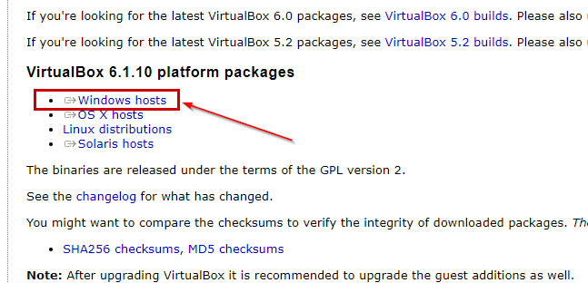+


- VBoxGuestAdditions: https://www.virtualbox.org/wiki/Downloads

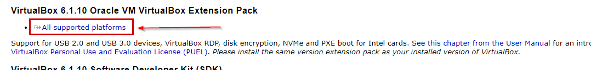


-  Oracle_VM_VirtualBox_Extension_Pack: http://download.virtualbox.org/virtualbox/6.1.10/

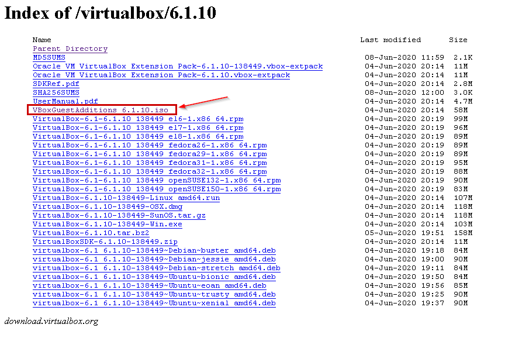+

### 2. Install VirtualBox 

### 3.  Install VirtualBox_Extension_Pack

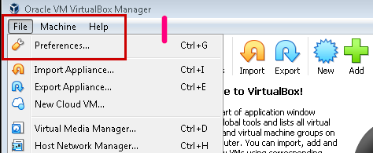+

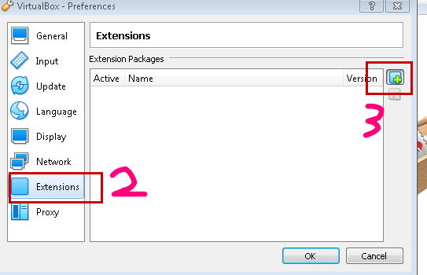+

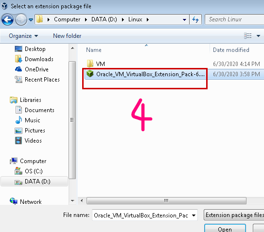+


### 4. Install Centos

- [使用VirtualBox安装CentOS7](https://www.cnblogs.com/gaomanito/p/11460381.html)
- [用virtualbox安装LINUX系统后下次打开时为什么又要重新安装？已经曾经登陆过一次。求帮助！](https://zhidao.baidu.com/question/1800554892249387467.html)

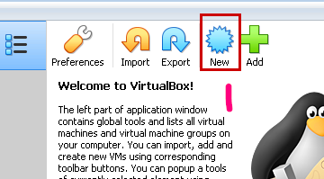+

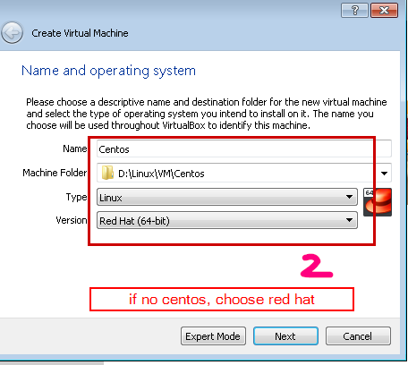+


用virtualbox安装LINUX系统后下次打开时为什么又要重新安装？

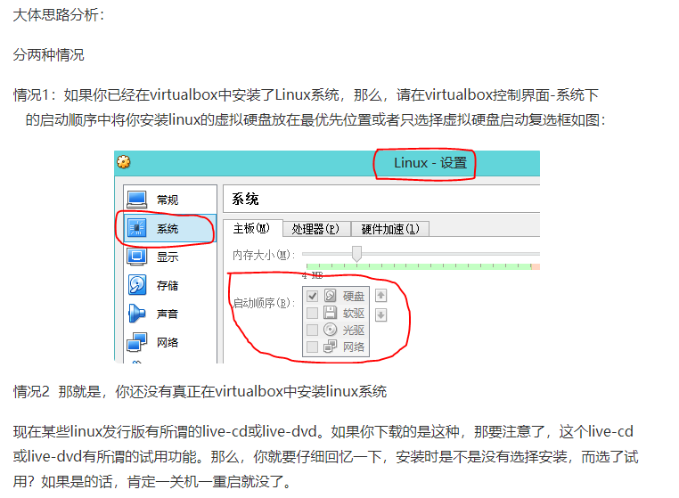

### 5. Install VBoxGuestAdditions

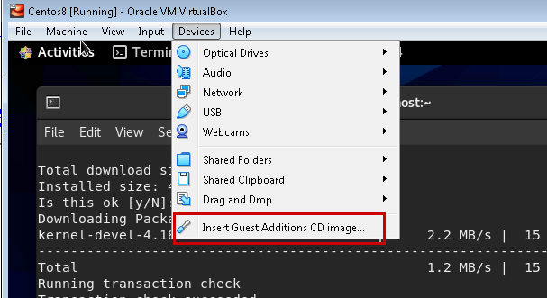+


如果安装报错：

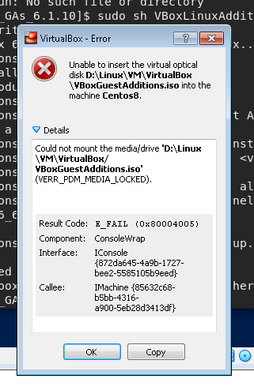+

可通过如下安装方式：

- [VirtualBox虚拟机CentOS安装增强功能Guest Additions](https://www.cnblogs.com/aliuwoai/p/10417453.html)
- [Virtualbox主机和虚拟机之间文件夹共享及双向拷贝](https://blog.csdn.net/wcx1293296315/article/details/82955219)

```linux
cd /run/media/
ls
```

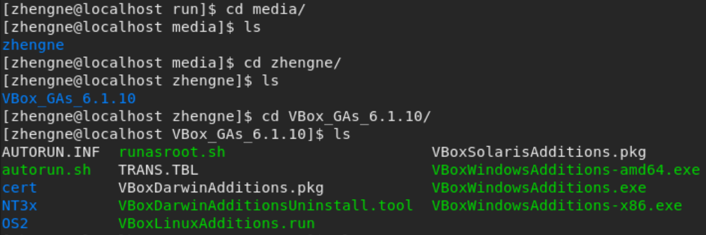

```linux
sudo sh VBoxLinuxAdditions.run
```

安装成功后，如果主机和虚拟机之间还是无法互相拷贝或文件共享，可设置如下：

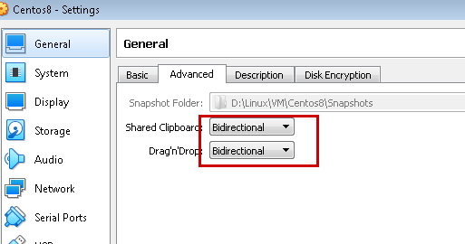+


### 6. Port mapping with host 

