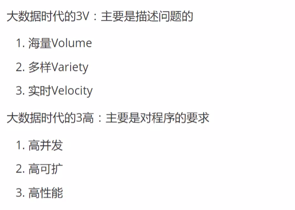
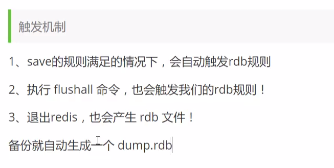
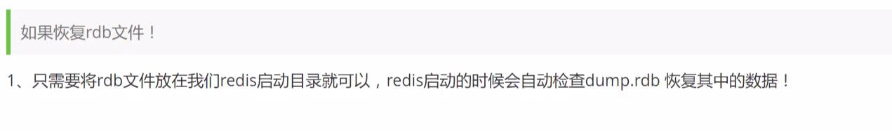
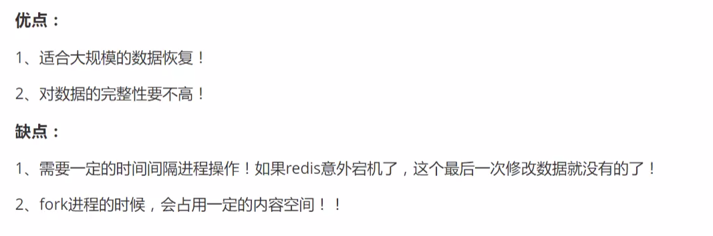
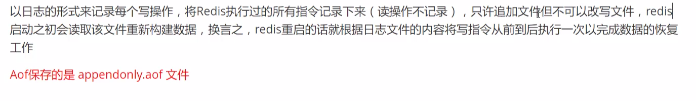
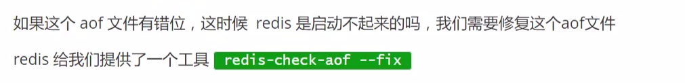
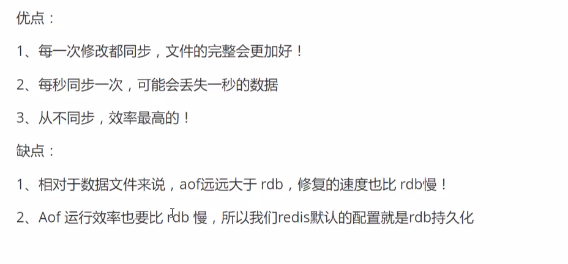
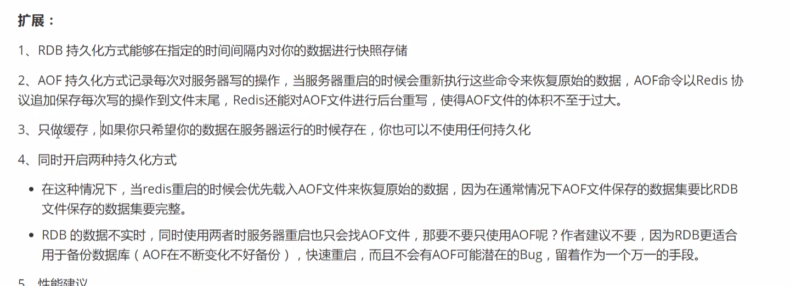
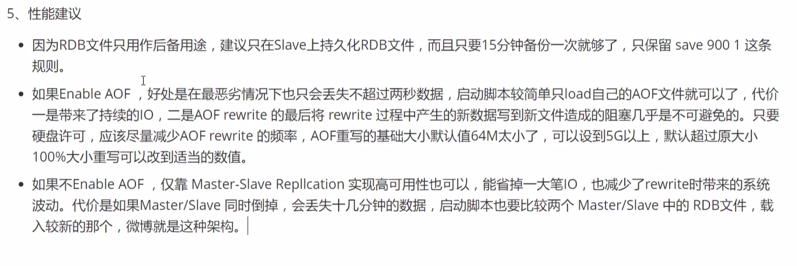

# Redis Learn

### 1. NoSQL 特点

**解耦！**

1. 方便扩展(数据之间没有关系，很好扩展)
2. 大数据量高性能(Redis一秒写8W次，读11W次。NoSQL的缓存记录是一种细粒度的缓存，性能会比较高)
3. 数据类型多样

### 2. 基础知识

- Redis默认有16个数据库(在redis.conf中配置)，默认使用的是第0个。

### 3. RDB

### 4. AOF

