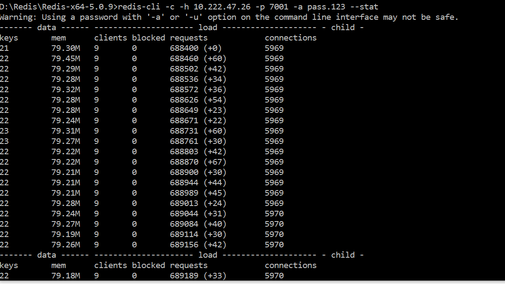

# Useful Commond

#### 1. redis-cli 连接远程cluster

```redis
redis-cli -c -h <IP> -p <PORT> -a <Password>
// -c: 指定连接的是cluster
// -a: 指定密码
```

#### 2. redis-cli 获取当前redis使用情况

```redis
redis-cli -c -h <IP> -p <PORT> -a <Password>  --stat
//requests 为启动以来累加请求数
```



