## Export and import tablespace,table by PLLSQL

**Reference:**

- [Oracle建立表空间和用户][https://blog.csdn.net/starnight_cbj/article/details/6792364]
- [oracle导出表结构1][https://wenku.baidu.com/view/94d33a95a0116c175f0e4824.html]
-  [ORACLE 数据库的用户存储数据导入与导出2](https://www.cnblogs.com/zhaideyou/articles/5845215.html)
- [(详)通过plsql对dmp文件进行导入和导出][https://blog.csdn.net/gray_key/article/details/81072345]


### 1. Create User

##### 1.1 Open PLSQL Command Window

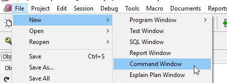

##### 1.2 Create User

>**Create:**  create user `user_name` identified by "`password`"; 
>
>**Grant:**  grant create session to `user_name` ; 
>
>​			  grant create table to  `user_name` ;
>
>​			  grant create tablespace to `user_name` ; 
>
>​			  grant create view to  `user_name` ; 

```sql
create user zhangsan identified by "zhangsan"; 
grant create session to zhangsan;
grant create table to zhangsan;
grant create tablespace to zhangsan;
grant create view to zhangsan;
```

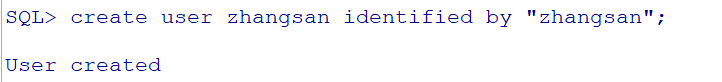

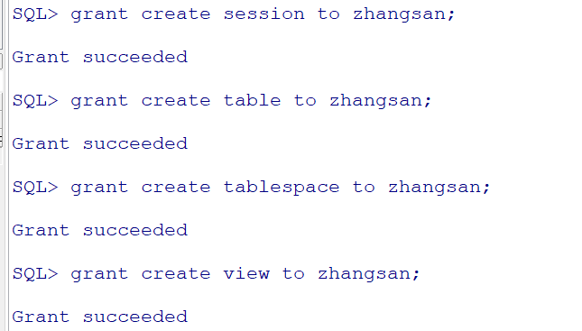

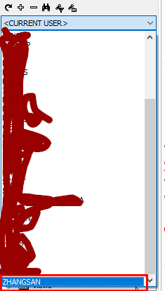


### 2. Create Tablespace

> **建立表空间(一般建N个存数据的表空间和一个索引空间)：**
> create tablespace 表空间名
> datafile ' 路径(要先建好路径).dbf  ' size M
> tempfile ' 路径.dbf ' size M
> autoextend on  --自动增长
> --还有一些定义大小的命令，看需要
>  default storage(
>  initial 100K,
>  next 100k,
> );

>**用户权限**
>
>授予用户使用表空间的权限：
>
>alter user 用户名 quota unlimited on 表空间;
>
>或 alter user 用户名 quota *M on 表空间;

>**删除表空间**
>
>drop tablespace 表空间 including contents and datafiles

##### 2.1 Create Tablespace

create tablespace restore path


```sql
create tablespace DEMOSPACE
datafile 'D:/test/tablespace/DEMOSPACE_TBSPACE.dbf'
size 15M
autoextend on next 1M maxsize 3000M;
```

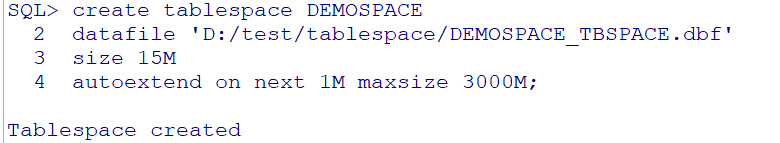

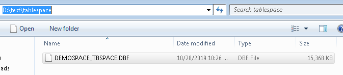

##### 2.2 Grant authorization

```sql
alter user zhangsan quota unlimited on DEMOSPACE;
```

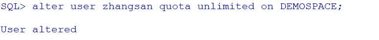

### 3. Export table ***Structure***, ***Data*** from Oracle

##### 3.1 PLSQL: 

##### Tools -> Export User Objects ->DBMS_Metadata

Choose tables that you'd like to export:

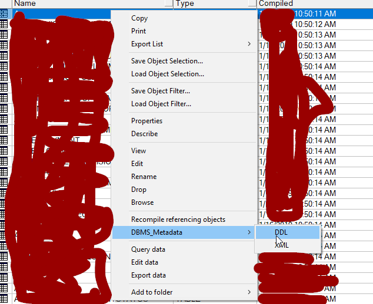

##### Tools -> Export User Objects -> View -> View SQL

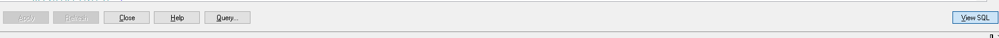

##### 3.2 Export table data

 reference the links of [ORACLE 数据库的用户存储数据导入与导出2](https://www.cnblogs.com/zhaideyou/articles/5845215.html)

### 4. Create new Table in new DB

##### 4.1 Exe the export SQL in SQL Window

> **Tips:**
>
> - the user,tablespace in 3.1 export SQL must be created first

##### 4.2 Grant table usage to other user

> CREATE or replace PUBLIC SYNONYM [`table_name`]() FOR `current_user_name`.[`table_name`]();
> GRANT SELECT, INSERT, UPDATE, DELETE, references, ALTER, INDEX ON `table_name` TO `another_user_name`;

### 5. Import Tables and Data

 reference the links of [ORACLE 数据库的用户存储数据导入与导出2](https://www.cnblogs.com/zhaideyou/articles/5845215.html)

### 6. Remove Tablespace

```sql
drop tablespace DEMOSPACE including contents and datafiles
```

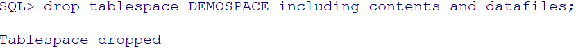

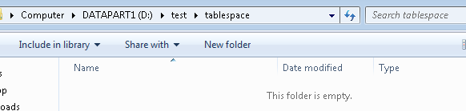

