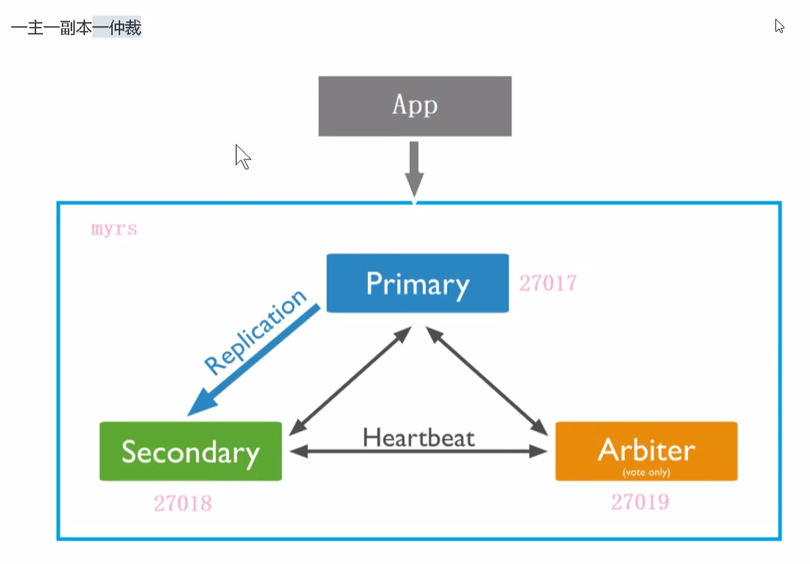

# Learn MongoDB

#### 1. MongoDB的特点

##### A. 高性能

对嵌入式数据模型的支持减少了数据库系统上的I/O活动。

索引支持更快的查询，并且可以包含来自嵌入式文档和数组的键。(文本索引解决搜索的需求、TTL索引解决历史数据自动过期的需求、地理位置索引可用于构建各种O2O应用、Gridfs解决大文件存储的需求)

##### B. 高可用性

MongoDB的复制工具称为副本集(replica set), 能够提供自动故障转移和数据冗余。

##### C. 高扩展性

分片将数据分布在一组集群的机器上。(海量数据存储，服务能力水平扩展)

从3.4开始，MongoDB支持基于片键创建数据区域。在一个平衡的集群中，MongoDB将一个区域所覆盖的读写只定向到该片区域的那些片。

无模式(field的数量不是固定的)，灵活的数据扩展。

##### D. 丰富的查询支持

CRUD、数据聚合、文本搜索、地理空间查询等

#### 2. 副本集(Replica Sets)

**主从复制和副本集区别**: 副本集没有固定的“主节点”；整个集群会选出一个“主节点”，当其挂掉后，又在剩下的从节点中选取其它节点为“主节点”，副本集总有一个活跃点(主,primary)和一个或多个备份节点(从,secondary)。

##### A. 副本集的三个角色

##### B. 主节点的选举原则

:triangular_flag_on_post:**触发条件**: 

1. 当前主节点故障
2. 当前主节点网络不可达(默认心跳信息是10s)
3. 人工干预(rs.stepDown(600))

:triangular_flag_on_post:**选举规则**:

**仲裁节点的优先级是0，是不能参与选举的,但是可以投票给其它节点。**

##### C. 节点故障

- **副本节点故障**: 主节点和仲裁节点对副本节点的心跳失败。读写数据都不受影响。不会触发投票选举。再次启动副本节点，主节点写入的数据会自动同步给从节点。

- **主节点故障**: 副本节点和仲裁节点对主节点的心跳失败，**当失败超过10s，此时没有主节点了，会自动发起投票**。
- **主节点和仲裁节点故障**: 副本节点无法被选举成主节点(在只有1主，1副，1仲的情况下副本节点没有获得大多数票，无法触发选举；如果要触发选举，随便加入一个成员即可)依然是只读状态，无法写入。
- **仲裁节点和副本节点故障**: 10s后，主节点会自动降级为副本节点(**服务降级**)

#### 3. 分片集群(Sharded Cluster)

##### A. 分片概念

##### B. 分片集群包含的组件

- **mongod(分片，负责存储)**: 每个分片包含分片数据的**子集**。每个分片都可以部署为副本集。
- **mongos(路由)**: mongos充当查询路由器，在客户端应用程序和分片集群之间提供接口。
- **config servers(“调度”的配置)**: 配置服务器存储集群的元数据和配置信息。从MongoDB3.4开始，必须将配置服务器部署为副本集(CSRS)。

##### C. 分片集群架构

**MongoDB只能通过一种策略来进行分片**

在进行**范围策略**进行分片时时，如果发现实际没有分片，则可能是下面原因造成的:

1. 系统繁忙，正在分片中
2. 数据块(chunk)没有填满，默认的数据块尺寸(chunksize)是 64M，填满后才会考虑向其他篇的数据块填充数据。为了满足需求可以修改默认数据块大小。

#### 4. Oracle和MongoDB的体系结构对比

