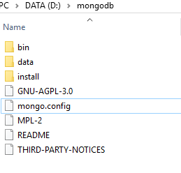
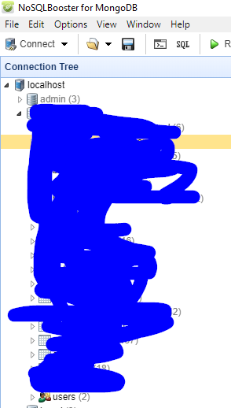
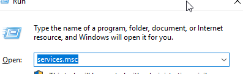
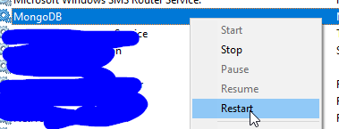
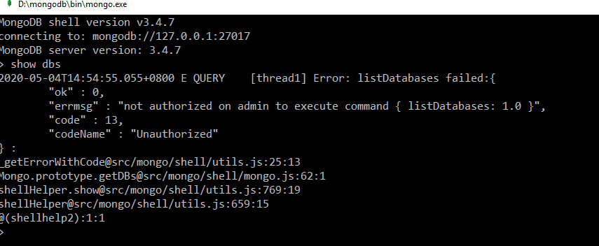

# Set Auth For Mongo DB

- [MongoDB 设置用户名密码登录](https://blog.csdn.net/qq_32502511/article/details/80619277)
- [手把手教你设置MongoDB密码](https://www.cnblogs.com/zilongmao/p/11428864.html)
- [mongodb配置用户名密码登录，以及mongodb用户角色权限](https://blog.csdn.net/u012373281/article/details/93748448?utm_medium=distribute.pc_relevant.none-task-blog-OPENSEARCH-2&depth_1-utm_source=distribute.pc_relevant.none-task-blog-OPENSEARCH-2)

> Mongo DB auth is setup by  date base not for whole system 

### 1. Enable Auth for mongo DB

> after mongodb installed, there  should has a config file. eg:   [mongo.config](..\..\files\mongo.config) , add  **auth = true**

### 2. Create user for data base

### 3. Restart mongo service

> services.msc

### 4. Connect with auth info

***no auth:***

***after auth:***

> use foo  ## foo is db name
>
> db.auth("simpleUser", "simplePass")

