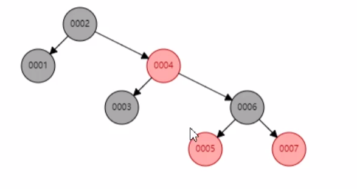
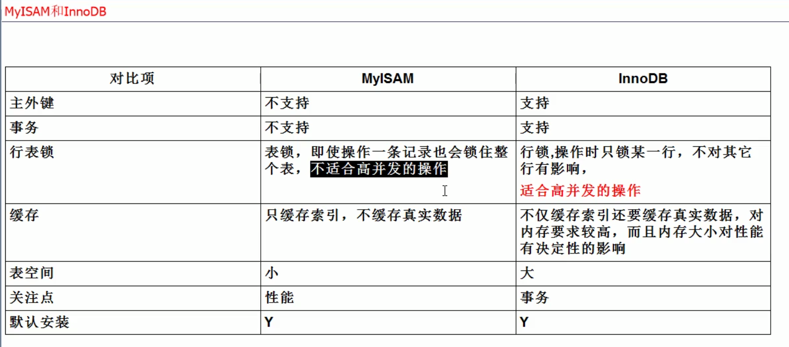
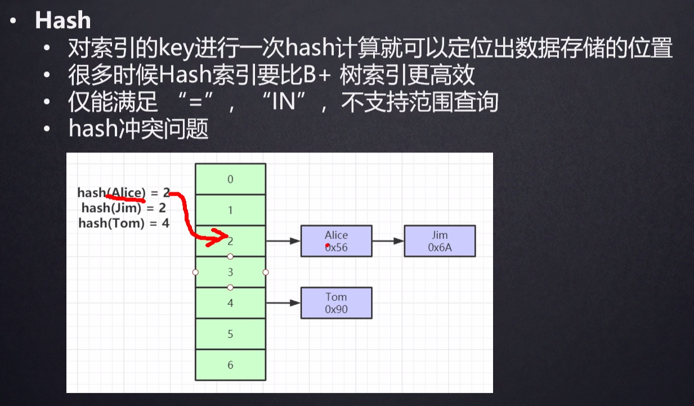

# MySQL Questions

#### 1. 索引数据结构二叉树，红黑树，Hash，B树，B+树

> **索引**是帮助MySQL高效获取数据的**排好序**的**数据结构**

:do_not_litter:**二叉树**: 当索引为单边增长的数据，二叉树会退化成链表，最后查询变成全表扫描

:do_not_litter:**红黑树(二叉平衡树):** 自带 平衡功能，不会出现二叉树那样单边增长的功能。但是当数据量变大时，树的高度会变得很高，索引的查询效率不高。

:do_not_litter:**B树**: 

:+1: **B+树**: 树的高度可控。每页(层)默认的存储大小是16Kb，前面的索引页只放索引(没有数据)大概占8个字节，中间放子节点地址的位置占6个字节，每页一般能放1170个索引，三层加上数据大概就可以存储2千万数据。实际中除了最后的叶子节点，其他索引页数据都是可以放在内存的，查找效率会很高。

> 1. 每一页的数据从左到右都是排好序的

**Q1. B+树底层查找索引的过程:**

1. 将根节点的索引全部加载到**内存**中进行**折半查找**。
2. 找到对应的叶子节点的指针后，再将叶子节点的索引全部加载到内存中进行折半查找。如此往复直至查找到对应的索引及数据。

#### 2. 存储引擎

> 存储引擎是用来形容数据库表的

- **MyISAM**存储引擎

  

​		对于MyISAM引擎来说，一张表对应磁盘上的三个文件:

​			 1. .frm: 存储的是表结构

​			 2.  .MYD: 存储表中的数据

​			 3. .MYI: 存储表中索引字段的数据

- **InnoDB**存储引擎

  

​		底层的数据存储结构对应磁盘中的两个文件，如下:

​			1. .frm: 存储的是表结构

​			2. .ibd: 既存储了数据又存储了索引

**Q1. 聚集索引和非聚集索引**:

聚集索引又叫聚簇索引，是指叶子节点包含了完整的数据记录。InnoDB的主键就是聚集索引。

非聚集索引又叫稀疏索引, 是指索引和数据分开存储，比如MyISAM引擎对应的索引。

**Q2. 为什么建议InnoDB表必须建主键，并且推荐使用整形的自增主键？**

**必须建主键**: InnoDB表里面的数据必须要有一个B+树的索引结构来组织整张表里面的数据。如果不建主键，MySQL默认会从数据表的第一列数据开始找一列数据都唯一的列来作为组织整个B+树结构的索引列。如果没找到，会帮忙建一列隐藏的自增列作为索引列。这样会降低MySQL的效率，同时也有可能浪费了数据空间。

**使用整形**: 用UUID(既不是整形，也不是自增)做主键，在进行索引的数据查找时，会从根节点开始比大小，如果是UUID比对效率不如整形。此外用整形也比用UUID字符串占用的空间小。

**使用自增**: 如果不是自增，比如说Hash做索引，对key做一次hash运算就可以定位出数据的位置，很多时候确实比B+树更高效。但是Hash索引仅支持相等查找，不支持范围查询，同时也存在Hash冲突的问题。而B+树的叶子节点之间有一个首尾想接的双向指针，提高了区间访问的性能。此外如果不是自增，插入数据时B+树为了保证有序性，会增大数据节点的分裂，而自增始终是在往后面节点加数据，分裂的次数更少。

**Q3. 为什么非主键索引结构的叶子节点存储的是主键值？**

> 为了一致性和节省存储空间。

**Q4. 联合索引的底层数据结构和最左前缀原则**

**底层数据结构**: 联合索引在数据插入排序时，会按逐个字段对比结果来排序，如果第一个字段能对比出来前后，就可以确定，如果不可以才对比第二个字段，以此类推。

**最左前缀原则**: 如果查询字段直接跳过排在前面的联合索引字段，则无法走索引查询。

#### 3. 一条SQL在MySQL的执行流程

1. 通过**客户端**去连接数据库的**连接器**进行登录等操作，从而连接上数据库。

   **连接器**主要作用:

   - **管理连接**: 新建连接

   - **校验权限**: 到MySQL默认的系统库里面找到User表，去加载当前用户多对应的权限，然后将权限load进内存中的管理对象进行校验，从而明确客户端过来建立的连接可以进行哪些操作。

     > 只有新建连接才回去load权限，也就是说如果中间改了权限，需要重新建立连接才能生效。

2. 如果是一个查询的话，会先去**缓存区**去查找是否有缓存，key是SQL，vaule是查询结果。如果有就会直接将结果返回给客户端。

3. 如果缓存中没有，会去到**词法分析器**分析出当前SQL语句是增删查改里面的哪一种，并分析语句的词法是否正确，如果不正确会返回语句错误提示。

4. 接下来会进入到**优化器**，通过算法判断走哪种执行计划效率更高。
5. 接下来进入到**执行器**，通过**执行器**根据表设计时定义的引擎来真正的调用执行引擎。MySQL的设计中，数据引擎都是以插件形式提供接口给MySQL使用。也就意味着数据引擎可以动态的扩展，甚至添加自定义的数据引擎。
6. **存储引擎**去文件磁盘对应的数据文件，找到结果集返回给执行器。
7. **执行器**拿到结果集后，会根据系统是否开启了缓存，如果开启了缓存而缓存区里面又没有对应的缓存，就会把数据集放到**缓存区**中以key-value的形式缓存。**缓存区**适用于读多写少的数据，查询缓存在5.7版本以后被移除，也就意味着之后的版本没有查询缓存这个功能。
8. **执行器**最后将结果通过**连接器**返回给**客户端**

#### 4. 日志模块

A. **Bin Log** (逻辑日志)

> MySQL实现高可用性的的基石，是在MySQL  Server(服务)层实现的，所有数据引擎都能用。
>
> **逻辑日志**: 记录语句执行的运算过程(1+3)

B. **Redo Log** (物理日志)

> InnoDB所独有的
>
> **物理日志**: 记录整个语句执行完后的结果。(比如张三:1+3=4,就会记录为张三:4)
>
> ​					日志有大小限制,数据先写入以下两个粉板文件，之后再通过检查机制同步至数据磁盘文件。
>
> 

**Redo Log执行流程**: 

1. 当有新的日志要写入时，会先通过writepos找到当前记录位置，循环边写边后移，如果ib_logfile0写满了，会去到ib_logfile1继续。
2. 当两个文件都写满时，checkpoint(检查是否还有空闲位的指针)会向后移动，并搽除已经提交的记录。
3. 如果记录还没有提交，引擎会停下来不让新的更新语句操作，并将log文件里面的记录同步到磁盘文件。然后checkpoint继续后移并搽除已提交的记录，腾出位置给新的记录。

innodb_flush_log_at_trx_commit 不同值的区别:

- 0: 每次提交，都先放入到log缓冲区，然后每隔一秒写入到用户缓冲区，并调用fsync写进存储器。**存在延迟的情况，数据更新不及时。**如果在这期间MySQL挂了，当前提交的数据会丢失。
- 1: 每次提交就直接写到磁盘里面，不存在延迟，数据是最安全的。但是性能就会比较低。
- 2: 每次提交都会将命令放到用户缓冲区，每隔一秒调用fsync写进存储器。**存在延迟的情况，数据更新不及时。**如果在这期间MySQL挂了，当前提交的数据会丢失。

#### 5. SELECT 语句的查询顺序

1. FROM 表
2. WHERE 筛选条件
3. ORDER BY
4. LIMIT