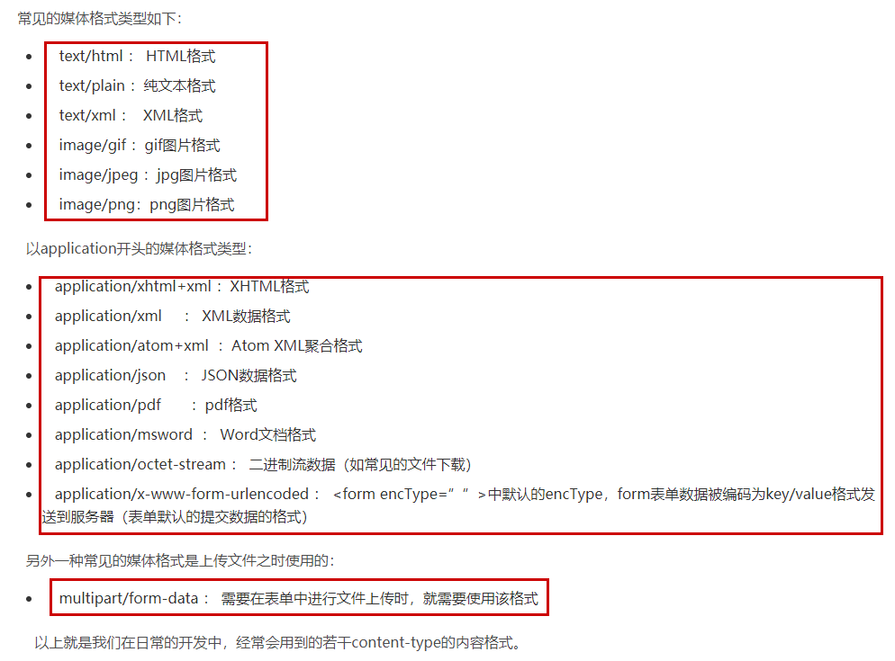

# Big File Download

- [SpringBoot下载文件实现及速度对比](https://blog.csdn.net/m0_38001814/article/details/89182120)
- [vue根据后台返回文件流转换为zip](https://blog.csdn.net/z9061/article/details/103969163)

## 一. With Vue as Web Site

### A. Vue Part

#### 1. Request params

```js
export function bigFileDownload (data) {
  return request({
    url: '/test/bigFileDownload',
    contentType: 'application/json;charset=UTF-8',
    method: 'post',
    //add responseType: "blob" for backend byte array download, if not the download file size will not same as actual, and can't unzip as well.  
    responseType: "blob",  
    data
  })
}
```

#### 2. Download function

```js
   download (filename, data) {
      if (!filename) {
        filename = 'temp.txt'
      }
      if (!data) {
        data = ''
      }
      let blob = new Blob([data])
      if (blob.size < 1) {
        this.$Message.error('file content is empty,skip download!')
      } else {
        if (window.navigator.msSaveOrOpenBlob) {
          navigator.msSaveBlob(blob, filename)
        } else {
          var link = document.createElement('a')
          link.href = window.URL.createObjectURL(blob)
          link.download = filename
          link.click()
          window.URL.revokeObjectURL(link.href)
        }
      }
    },
```

### B. Springboot Part

#### 1.Controller

- [Http请求中Content-Type讲解以及在Spring MVC中的应用](https://blog.csdn.net/blueheart20/article/details/45174399)



> add `MediaType.APPLICATION_OCTET_STREAM_VALUE` for byte download

```groovy
	@PostMapping(value = 'bigFileDownload',produces = MediaType.APPLICATION_OCTET_STREAM_VALUE)
	ResponseEntity<byte[]>  bigFileDownload(@RequestBody Map<String,String> params){
		log.info("MessageTrackingController.bigFileDownload request received info: " + params.get("archiveFullPath"))

		ResponseEntity<byte[]> responseEntity = messageTrackingService.bigFileDownload(params.get("archiveFullPath"))
		log.info("MessageTrackingController.bigFileDownload request return info: " + responseEntity)

		return responseEntity
	}
```

### 2. Service

```groovy
	ResponseEntity<byte[]> bigFileDownload(String archiveFullPath) {
		MessageArchive messageArchive = messageArchiveService.searchMessageFileWithoutContent(archiveFullPath)
		GridFsResource gridFsResource = gridFsTemplate.getResource(gridFsTemplate.findOne(Query.query(Criteria.where("_id").is(messageArchive.storageId))))
        // 请求体
		byte[] body = gridFsResource.inputStream.bytes
        // 请求头
		HttpHeaders httpHeaders = new HttpHeaders()
		httpHeaders.add("Cache-Control", "no-cache, no-store, must-revalidate")
        // 告诉浏览器弹出下载对话框
		httpHeaders.add("Content-Disposition", "attachment; filename=" + messageArchive.fileName) //actually not used
		httpHeaders.add("Pragma", "no-cache")
		httpHeaders.add("Expires", "0")
		httpHeaders.add("Last-Modified", new Date().toString())
		httpHeaders.add("ETag", String.valueOf(System.currentTimeMillis()))

		return new ResponseEntity(body,HttpHeaders.readOnlyHttpHeaders(httpHeaders), HttpStatus.OK)
	}
```

