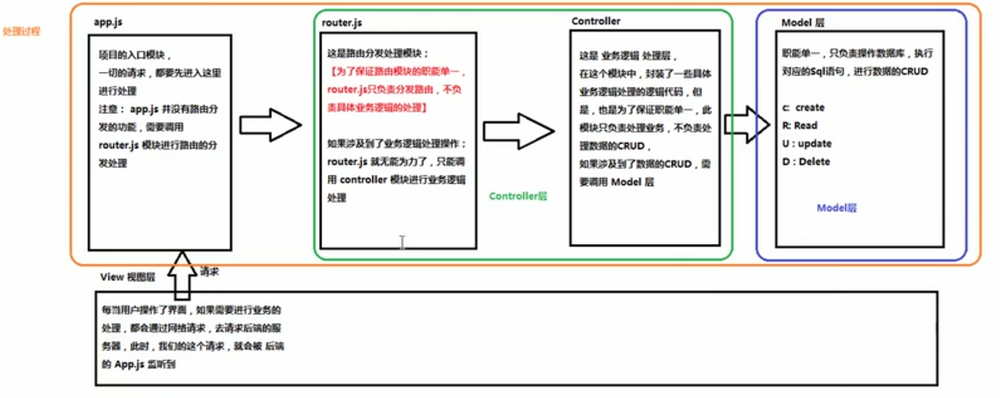
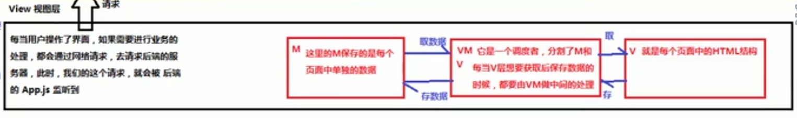

# Vue Basic Knowledge

## Ⅰ. 使用Vue / Angular / React 等框架的好处

> 框架和库的区别：框架能加快项目开发，对项目代码的侵入性高，一旦使用不容易更换；库对项目侵入性							   低，可替换，但一般只提供单一的功能模块。

### A. 传统MVC架构的职能分配及工作流程(前端+后端)

### B. MVVM架构（前端）

**MVVM是前端`视图层`（View）的分层开发思想，主要把每个页面分成了`M`、`V`和`VM`。其中VM是MVVM思想的核心，因为VM是 M和V之间的`调度者`.**

> 使用MVVM的思想，主要是为了让开发更方便，因为VM提供了双向数据绑定。

