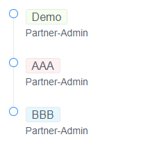

# Vue CSS

### 1. set random background color

#### A. create js function

- random color

```js
    randomRgbaColor () { //随机生成RGB颜色
      var r = Math.floor(Math.random() * 256); //随机生成256以内r值
      var g = Math.floor(Math.random() * 256); //随机生成256以内g值
      var b = Math.floor(Math.random() * 256); //随机生成256以内b值
      return `rgb(${r},${g},${b})`; //返回rgba(r,g,b,a)格式颜色
    },
```

- random color in a list

```js
    randomRgbaColor () {
      var colors = ['#f6ffed', '#e6fffb', '#f9f0ff', '#fff1f0', '#e6f7ff', '#fffbe6'];
      var random_color = colors[Math.floor(Math.random() * colors.length)];

      return random_color;
    },
```

#### B. apply to html 

```iview
<Tag :style="{'background':randomRgbaColor()}" style="font-size: 16px;">{{data.organizationId}}
```



