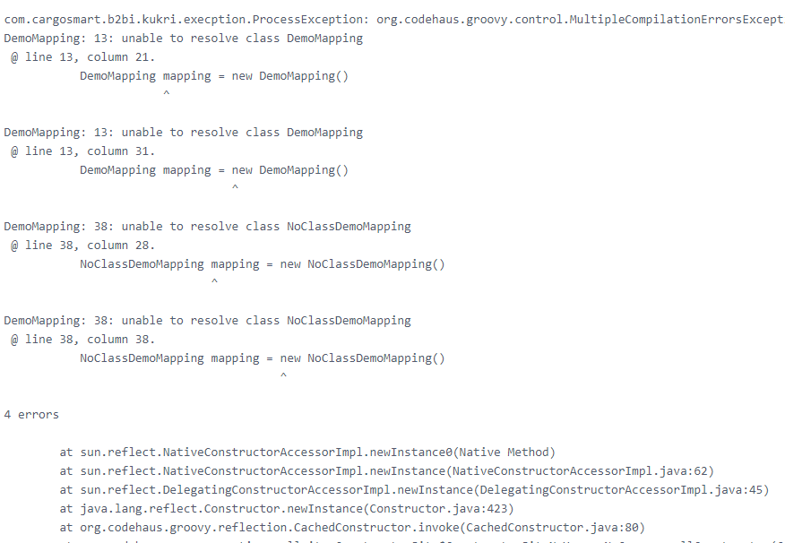

# Vue usage skills

- [手摸手，带你优雅的使用 icon](https://juejin.im/post/59bb864b5188257e7a427c09)

### 一、 `watch` for data change

- [vue.js 父组件主动获取子组件的数据和方法、子组件主动获取父组件的数据和方法](https://blog.csdn.net/zhongshijun521/article/details/80610971)
- [Vue父组件获取子组件数据](https://blog.csdn.net/weixin_41996632/article/details/89680953)

- [Vue中对watch的理解(尤其是immediate和deep属性)](https://blog.csdn.net/qq_40323256/article/details/101907326)


### 二、HTML \r, \n, \t special char show 

- [Html中换行符\n的传输、保存、显示?](https://www.cnblogs.com/aikewang/p/5833625.html)
- [Html—让textarea标签中的内容原格式输出的两种办法](https://www.jianshu.com/p/09952e0e0020?from=timeline)

```html
<pre>{{processResultList[index].errorDescription}}</pre>
```




### 三、vue-router使用next()跳转到指定路径时会无限循环

- [vue-router使用next()跳转到指定路径时会无限循环](https://www.cnblogs.com/yuwenjing0727/p/9916691.html)

> vue-router的next()方法无参和有参时是不一样的.
>
> 当执行钩子函数时如果遇到next('/home')等时会中断当前导航，比如当前导航是去/a,那么遇到next('/home')后就会把to.path改为/home，然后会重新触发这个离开的钩子，注意：此时会重新触发执行这个钩子，而不是在这个钩子函数继续执行的，之前是一直没理解这里，以为是执行next('/home')后就会直接跳到home页面呢，当重新触发后就会继续执行next('/home')所以会一直循环。
>
> 至于解决办法就是判断下，如果已经是/home了就next()。

```javascript
beforeRouteLeave (to, from, next) {
        console.log('离开路路由')
       if(to.fullPath==='/home'){
         next();
       }else{
         next('/home')
       }
```

```javascript
// 下面的写法会死循环
     beforeRouteLeave (to, from, next) {
        console.log('离开路路由')
       next('/home')
}
```

### 四、Vue watch单个值变化

- [vue 2.0 watch 监听对象的变化](https://www.cnblogs.com/anani/p/9287986.html)

#### 1. data

```js
  data () {
    return {
      searchData: {
        messageRecord: {
          organizationId: '',
          messageRecordId: '',
          status: '',
          inputFileName: '',
          outputFileName: '',
          channelName: '',
        },
        test: '',
        totalSize: null,
        currentPage: 1,
        limit: 10
      },
    }
  }
```

#### 2. watch

```js
  watch: {
    'searchData.messageRecord.organizationId': {
      handler: function (value, oldValue) {  //必须使用handler
        this.initChannelNameList(value)
        this.searchData.messageRecord.channelName = ''

      },
      deep: true,
    },
  },
```

