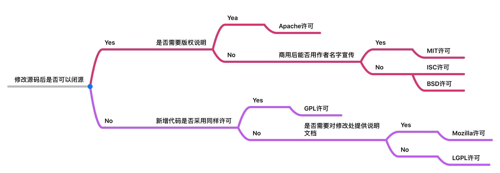

1. [正则表达式性能测试](https://regex101.com/)
2. [正则表达式全集](http://tool.oschina.net/uploads/apidocs/jquery/regexp.html)
3. [ASCII码表](https://www.litefeel.com/tools/ascii.php)
4. [Unicode字符集](https://www.rapidtables.com/code/text/unicode-characters.html)
5. [GC(Allocation Failure)引发的一些JVM知识点梳理](https://blog.csdn.net/zc19921215/article/details/83029952)
6. [用于浏览源代码的网站](http://grepcode.com/)
7. [七种开源许可证](https://www.jianshu.com/p/86251523e898)



### UI

1. [BgRemover - 在线图片去底工具 - 将纯色背景的图片转换为背景透明的图片](http://www.aigei.com/bgremover/)
2. [SVG Sprites还原工具，内置Font Awesome小图标](https://www.zhangxinxu.com/sp/icon/)
3. [vue中watch的几种用法](https://blog.csdn.net/wangbinXMU/article/details/97619725)


### UI-Vue

1. [Vue的computed和watch的细节全面分析](https://segmentfault.com/a/1190000012948175?utm_source=tag-newest)


### Oracle

1. [Oracle建立表空间和用户](https://blog.csdn.net/starnight_cbj/article/details/6792364)
2. [oracle导出表结构1](https://wenku.baidu.com/view/94d33a95a0116c175f0e4824.html)
3. [Oracle数据库联合主键](https://blog.csdn.net/long_long_ago1/article/details/82670911)
4. [Oracle之唯一性约束(UNIQUE Constraint)用法详解](https://blog.csdn.net/liuxiangke0210/article/details/78752275)
5. [oracle添加外键约束的两种方式](https://blog.csdn.net/lydia88/article/details/84500812)
6. [Oracle修改字段名、字段数据类型](https://www.cnblogs.com/fx-blog/p/7133538.html)
7. [Oracle创建表、删除表、修改表（添加字段、修改字段、删除字段）语句总结](https://www.linuxidc.com/Linux/2019-07/159430.htm)


### SpringBoot&Java

1. [ spring-boot-starters](https://github.com/spring-projects/spring-boot/tree/v2.1.0.RELEASE/spring-boot-project/spring-boot-starters)

2. [CAS原子操作以及其在Java中的应用](https://www.jianshu.com/p/973efae31be3)

3. [SpringBoot中使用SpringDataJPA](https://www.cnblogs.com/wadmwz/p/10313495.html)

4. [Spring Boot JPA 使用以及设置多个主键](https://blog.csdn.net/xx326664162/article/details/80053719)

5. [自动维护创建时间和更新时间](https://www.bbsmax.com/A/GBJre1DWz0/)

6. [jdbc:oracle:thin:@192.168.3.98:1521:orcl（详解）](https://blog.csdn.net/qingfeng45697/article/details/47779093)

7. [SpringBoot 统一时区的方案](https://www.jianshu.com/p/504c17b35e17)

8. [Springboot调用外部RestFul接口的几种方法](https://www.cnblogs.com/umrx/p/9387484.html)

9. [SpringBoot-RestTemplate实现调用第三方API](https://blog.csdn.net/a1032818891/article/details/81172478)

10. [Java实现将文件或者文件夹压缩成zip](https://www.cnblogs.com/zeng1994/p/7862288.html)

11. [spring-data-mongodb-remove-_class-define-explicitly](http://athlan.pl/spring-data-mongodb-remove-_class-define-explicitly/)

    ```java
    @Configuration
    public class AuthDataSourceConfiguration {
     
    	// ...
     
    	@Bean
    	public MongoClient mongoDbClient() throws Exception {
    		return new MongoClient(new ServerAddress("127.0.0.1"));
    	}
     
    	@Bean
    	public MongoDbFactory mongoDbFactory() throws Exception {
    		return new SimpleMongoDbFactory(mongoDbClient(), "dbname");
    	}
     
    	@Bean
    	public MongoTemplate mongoTemplate() throws Exception {
    		MongoTypeMapper typeMapper = new DefaultMongoTypeMapper(null);
            MappingMongoConverter converter = new MappingMongoConverter(mongoDbFactory(), new MongoMappingContext());
            converter.setTypeMapper(typeMapper);
     
    		MongoTemplate mongoTemplate = new MongoTemplate(mongoDbFactory(), converter);
    		return mongoTemplate;
    	}
    }
    ```

    12. 


### SpringBoot Data JPA

1. [Spring Data JPA，一种动态条件查询的写法](https://www.cnblogs.com/derry9005/p/6282571.html)
2. [SpringBoot中使用SpringDataJPA](https://www.cnblogs.com/wadmwz/p/10313495.html)
3. [java-jpa-criteriaBuilder使用](https://www.cnblogs.com/g-smile/p/9177841.html)
4. [spring mongodb分页，动态条件、字段查询](https://www.bbsmax.com/A/1O5EnjYbd7/)
5. [springboot mongodb jpa常用方法整理](https://www.cnblogs.com/zincredible/p/9206655.html)


### SpringBoot Mybatis

1. [spring boot 如何优雅的使用mybatis-spring-boot-starter](https://blog.csdn.net/zmx729618/article/details/80773887)
2. [Spring Boot中集成Mybatis(动态拼接SQL)](https://blog.csdn.net/hdn_kb/article/details/100139885)
3. [MyBatis中的@results注解使用](https://blog.csdn.net/weixin_44149454/article/details/90373036)
4. [Spring Data Specification的用法,group by,order by及复杂情况和Pageable的注意事项](https://blog.csdn.net/qq_36564291/article/details/88717082)


### Springboot MongoDB

1. [Spring Data Jpa：分页、Specification、Criteria](https://www.jianshu.com/p/e7882c4f29b6)
2. [spring data jpa Specification 复杂查询+分页查询](https://www.cnblogs.com/hankuikui/p/11414316.html)
3. [MongoDB操作符之$elemMatch](https://www.cnblogs.com/SwordArt/p/12588365.html)
4. [ MongoDB——$elemMatch(内嵌文档查询匹配) ](https://blog.csdn.net/shiyaru1314/article/details/68496642)
5. [mongodb详细优化策略方案](https://blog.csdn.net/Felix_CB/article/details/86296890)
6. [MongoDB第八讲查询优化](https://www.jianshu.com/p/3ae79de4caae)
7. [MongoDB查询优化-MongoDB Profiler](https://www.cnblogs.com/operationhome/p/10728654.html)
8. [spring-data-mongodb查询结果返回指定字段](https://www.cnblogs.com/usual2013blog/p/4103549.html)
9. [java大文件分块上传分享](https://blog.csdn.net/weixin_42584752/article/details/80873376)
10. [大文件上传第二弹(分片、秒传、断点续传)](https://blog.csdn.net/haohao123nana/article/details/54692669)
11. [SpringBoot下载文件实现及速度对比](https://blog.csdn.net/m0_38001814/article/details/89182120)


### Excel

1. [Excel 找出两列中的相同或不同的数据](https://jingyan.baidu.com/article/19020a0a68bd5d529d28429d.html)


### Docker

1. [【docker-compose】docker-compose.yml文本内容详解 + docker-compose命令详解 + docker-compose启动服务容器时区设置](https://www.cnblogs.com/sxdcgaq8080/p/10072040.html)


### Nginx

1. [每天一个linux命令13之curl发送http请求](https://www.cnblogs.com/edgedance/p/7096660.html)
2. [nginx docker容器配置https(ssl)](https://segmentfault.com/a/1190000017753319)
3. [HTTPs setup - Certbot + Docker + Nginx](https://www.jianshu.com/p/a4692f1e3208)
4. [Nginx https配置 和 反向代理到spring boot和vue.js](https://segmentfault.com/a/1190000016760251)(return 301 https://$server_name$request_uri;有bug),可参考 [nginx.conf](files\nginx.conf) 

